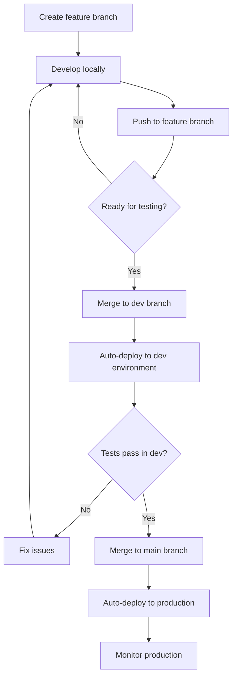

# Git Branching Strategy for Dev/Production Environments

**Created:** January 14, 2026  
**Strategy:** Gitflow-inspired with automated deployments

---

## 🎯 Overview

This document defines the Git branching strategy for managing development and production deployments with automatic CI/CD.

---

## 🌳 Branch Structure

```
main (production)
  ↑
  └── dev (development)
       ↑
       └── feature/* (local development)
```

### Branch Purposes

| Branch | Environment | Auto-Deploy | Purpose |
|--------|-------------|-------------|---------|
| `main` | Production | ✅ Yes | Production-ready code |
| `dev` | Development | ✅ Yes | Integration and testing |
| `feature/*` | Local | ❌ No | Individual features |

---

## 📋 Workflow

### 1. Starting New Work

```bash
# Ensure you're on latest dev
git checkout dev
git pull origin dev

# Create feature branch
git checkout -b feature/my-feature-name

# Work on your feature
# ... make changes ...
git add .
git commit -m "feat: add my feature"
```

### 2. Pushing to Development

```bash
# Option A: Merge to dev locally
git checkout dev
git pull origin dev
git merge feature/my-feature-name
git push origin dev

# Option B: Create Pull Request (Recommended)
git push origin feature/my-feature-name
# Then create PR: feature/my-feature-name → dev
```

**Result:** Auto-deploys to dev environment (https://*-dev.seemplifyai.com)

### 3. Testing in Dev Environment

1. Wait for GitHub Actions to complete deployment
2. Test your changes at: https://app-dev.seemplifyai.com (or relevant -dev domain)
3. Verify functionality works as expected
4. Check logs in Dokploy if issues arise

### 4. Promoting to Production

```bash
# Option A: Merge to main locally
git checkout main
git pull origin main
git merge dev
git push origin main

# Option B: Create Pull Request (Recommended)
# Create PR: dev → main
# Get team review
# Merge when approved
```

**Result:** Auto-deploys to production (https://*.seemplifyai.com)

---

## 🔄 Complete Development Cycle



---

## 🛠️ Branch Management Commands

### Setup Dev Branch (One-Time)

```bash
# Create dev branch from main
git checkout main
git pull origin main
git checkout -b dev
git push -u origin dev

# Set up branch protection (optional, via GitHub UI)
```

### Keep Dev Synced with Main

```bash
# Periodically sync dev with main to avoid drift
git checkout dev
git pull origin dev
git merge origin/main
git push origin dev
```

**Frequency:** Weekly or after major production releases

### Delete Old Feature Branches

```bash
# List all branches
git branch -a

# Delete local branch
git branch -d feature/old-feature

# Delete remote branch
git push origin --delete feature/old-feature
```

---

## 📜 Branch Protection Rules (Optional but Recommended)

### For `main` Branch

Configure in GitHub: Settings → Branches → Add rule

- ✅ Require pull request reviews before merging (1-2 reviewers)
- ✅ Require status checks to pass before merging
- ✅ Require branches to be up to date before merging
- ✅ Prevent force pushes
- ✅ Prevent deletion

### For `dev` Branch

Configure in GitHub: Settings → Branches → Add rule

- ✅ Require pull request reviews (optional, 1 reviewer)
- ✅ Require status checks to pass before merging
- ⬜ Can be less strict than main
- ✅ Prevent force pushes
- ✅ Prevent deletion

### For `feature/*` Branches

- ❌ No protection needed
- Can be deleted after merging
- Can be force-pushed during development

---

## 🚀 Deployment Flow

### Automatic Deployments

| Trigger | Target Branch | Environment | Domains |
|---------|--------------|-------------|---------|
| Push to `dev` | dev | Development | *-dev.seemplifyai.com |
| Push to `main` | main | Production | *.seemplifyai.com |

### Manual Deployments

Via GitHub Actions UI:

1. Go to: https://github.com/YOUR_ORG/seemplify/actions
2. Select workflow (e.g., "Deploy Recruiter Backend (Dev)")
3. Click "Run workflow"
4. Select branch (`dev` or `main`)
5. Click "Run workflow" to confirm

---

## 📝 Commit Message Convention

Follow [Conventional Commits](https://www.conventionalcommits.org/):

```
<type>(<scope>): <subject>

<body>

<footer>
```

### Types

- `feat:` - New feature
- `fix:` - Bug fix
- `docs:` - Documentation changes
- `style:` - Code style changes (formatting, no logic change)
- `refactor:` - Code refactoring
- `perf:` - Performance improvements
- `test:` - Adding or updating tests
- `chore:` - Maintenance tasks

### Examples

```bash
git commit -m "feat(recruiter): add bulk candidate import"
git commit -m "fix(leave): resolve calendar sync issue"
git commit -m "docs: update API documentation"
git commit -m "refactor(performance): optimize review queries"
```

---

## 🔍 Common Scenarios

### Scenario 1: Hotfix for Production

**Urgent bug in production:**

```bash
# Option A: Quick fix from main
git checkout main
git pull origin main
git checkout -b hotfix/fix-critical-bug
# ... make fix ...
git commit -m "fix: resolve critical bug"
git checkout main
git merge hotfix/fix-critical-bug
git push origin main  # Auto-deploys to production

# Also merge to dev to keep it updated
git checkout dev
git merge main
git push origin dev

# Option B: Branch from main, PR to main
git checkout -b hotfix/fix-critical-bug main
# ... make fix ...
git push origin hotfix/fix-critical-bug
# Create PR: hotfix/fix-critical-bug → main
# After merge, also merge main → dev
```

### Scenario 2: Working on Multiple Features

```bash
# Feature 1
git checkout -b feature/add-email-notifications dev
# ... work ...
git push origin feature/add-email-notifications
# Create PR to dev

# Switch to Feature 2 (without waiting for Feature 1)
git checkout dev
git pull origin dev
git checkout -b feature/improve-search dev
# ... work ...
git push origin feature/improve-search
# Create PR to dev

# Both features can be developed and merged independently
```

### Scenario 3: Feature Depends on Another Feature

```bash
# Base feature merged to dev
git checkout dev
git pull origin dev

# New feature builds on it
git checkout -b feature/extend-notifications dev
# ... work that depends on feature from dev ...
git push origin feature/extend-notifications
# PR to dev

# If base feature not yet in dev, branch from feature branch:
git checkout feature/add-email-notifications
git checkout -b feature/extend-notifications
# ... work ...
```

### Scenario 4: Reverting a Bad Deployment

**If dev deployment breaks:**

```bash
git checkout dev
git revert <commit-hash>
git push origin dev  # Auto-redeploys without the bad commit
```

**If production deployment breaks:**

```bash
git checkout main
git revert <commit-hash>
git push origin main  # Auto-redeploys production to previous state

# Also update dev
git checkout dev
git merge main
git push origin dev
```

---

## ✅ Best Practices

### Do's ✅

- ✅ Always create feature branches from `dev`
- ✅ Test thoroughly in dev before merging to main
- ✅ Use descriptive branch names (`feature/add-calendar-sync`)
- ✅ Write clear commit messages
- ✅ Keep dev synced with main periodically
- ✅ Delete feature branches after merging
- ✅ Use Pull Requests for code review

### Don'ts ❌

- ❌ Never commit directly to `main` (except hotfixes if unavoidable)
- ❌ Never force push to `main` or `dev`
- ❌ Don't merge to main without testing in dev first
- ❌ Don't leave feature branches open for months
- ❌ Don't work directly on `dev` branch (use feature branches)
- ❌ Don't push sensitive data (API keys, passwords) to any branch

---

## 🔐 Environment-Specific Code

### Avoid Hardcoding Environments

**Bad:**
```javascript
const API_URL = "https://api-dev.seemplifyai.com";  // ❌ Hardcoded
```

**Good:**
```javascript
const API_URL = process.env.NEXT_PUBLIC_API_URL;  // ✅ From env vars
```

### Environment Variables Handle Differences

- Dev branch deploys with dev environment variables (in Dokploy)
- Main branch deploys with production environment variables
- No code changes needed between environments

---

## 📊 Branch Lifecycle

```
1. Created from dev
   ↓
2. Development (commits, pushes)
   ↓
3. PR to dev → Review → Merge
   ↓
4. Auto-deploy to dev environment
   ↓
5. Testing in dev
   ↓
6. PR dev → main → Review → Merge
   ↓
7. Auto-deploy to production
   ↓
8. Delete feature branch (cleanup)
```

---

## 🧪 Testing Strategy

### Test Locally
- Run application locally before pushing
- Test with local dev database
- Fix linting and build errors

### Test in Dev Environment
- Deploy to dev via merge/PR
- Test all functionality end-to-end
- Verify integrations work
- Check mobile responsiveness

### Test in Production
- Monitor closely after deployment
- Have rollback plan ready
- Check error logs and monitoring

---

## 📝 Quick Reference

### Daily Workflow

```bash
# Morning: Get latest dev
git checkout dev
git pull origin dev

# Create feature branch
git checkout -b feature/my-feature

# Work and commit
git add .
git commit -m "feat: add feature"

# Push and create PR
git push origin feature/my-feature
# Create PR: feature/my-feature → dev

# After merge: cleanup
git checkout dev
git pull origin dev
git branch -d feature/my-feature
```

### Release to Production

```bash
# Ensure dev is ready
git checkout dev
git pull origin dev

# Merge to main
git checkout main
git pull origin main
git merge dev
git push origin main  # Auto-deploys to production

# Monitor deployment in GitHub Actions and Dokploy
```

---

## 🆘 Troubleshooting

### Merge Conflicts

```bash
# When merging dev to main (or vice versa)
git checkout main
git merge dev

# If conflicts:
# 1. Open conflicted files
# 2. Resolve conflicts manually
# 3. Stage resolved files
git add .
git commit -m "chore: resolve merge conflicts"
git push origin main
```

### Deployment Not Triggering

**Check:**
1. GitHub Actions workflow exists for your branch
2. File changes match the path patterns in workflow
3. GitHub Actions is enabled for the repository
4. Secrets are configured correctly

**View in GitHub:**
- Go to Actions tab
- Check workflow runs
- Review logs for errors

### Wrong Environment Deployed

**If dev code goes to production:**
- Immediately revert the commit on main
- Push to redeploy previous production version
- Investigate why dev was merged without testing

---

## 📚 Additional Resources

- [Git Documentation](https://git-scm.com/doc)
- [GitHub Flow](https://guides.github.com/introduction/flow/)
- [Conventional Commits](https://www.conventionalcommits.org/)
- [Semantic Versioning](https://semver.org/)

---

**Remember:** 
- `dev` is your playground - deploy often, test freely
- `main` is sacred - only thoroughly tested code
- Feature branches are temporary - create, use, delete
- Automated deployments make life easier - trust the process!
