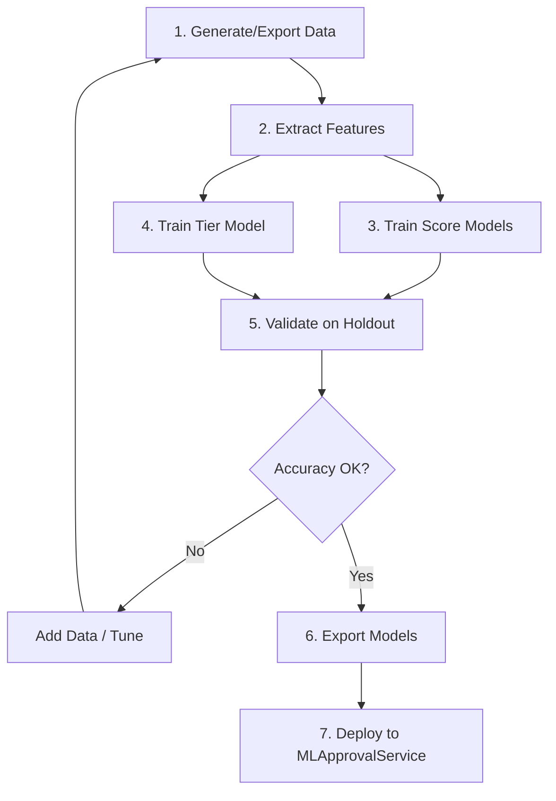

# ML Approval Training Plan

## Hybrid LightGBM + LLM for AI Initiative Approval

This plan describes how to train a LightGBM-based approval system that can handle nuances, with confidence-based fallback to the LLM when needed.

---

## 1. Overview

| Aspect | Approach |
|--------|----------|
| **Primary model** | LightGBM (scores, tier, approve/reject) |
| **Features** | Structured form fields + engineered nuance features + embeddings |
| **Fallback** | LLM when confidence < threshold |
| **Rule analysis** | Keyword + embedding similarity + optional per-rule classifier |

---

## 2. Can It Be Trained for Nuances?

**Yes**, but in layers:

| Nuance Type | Training Approach | Priority |
|-------------|-------------------|----------|
| **Structured fields** | Direct features (already in form) | P0 |
| **Numeric thresholds** | Extract from text (budget, timeline) + rules | P0 |
| **Common phrases** | Regex/keyword features in training data | P0 |
| **Semantic similarity** | Embeddings as features; model learns weights | P0 |
| **Logical conditions** | Explicit boolean features (e.g. `has_exception`) | P1 |
| **Negation** | Negation-detection features ("no", "without", "excludes") | P1 |
| **Hedging** | Phrases like "may", "partially", "mostly" as features | P2 |

Nuances that require deep language understanding (e.g. complex "unless" clauses) remain in the LLM fallback path.

---

## 3. Training Data Generation

### 3.1 Data Volume

| Phase | Examples | Purpose |
|-------|----------|---------|
| **Minimum viable** | 1,500–2,000 | Initial model |
| **Production-ready** | 3,000–5,000 | Better generalization |
| **With edge cases** | 5,000+ | Nuance coverage |

### 3.2 Generation Methods

**A. LLM-labeled synthetic data**

1. Create initiative templates (vary: domain, budget, urgency, data type, etc.)
2. Use current LLM to label each: `rulesAnalysis`, `scoringBreakdown`, `priorityScore`, `tier`
3. Store both `formData` (structured) and `description` (text)

**B. Nuance-focused augmentations**

Inject variations to capture nuance:

| Nuance | Template variation | Label change |
|--------|-------------------|--------------|
| Executive sponsor | "Budget ₦600k" vs "Budget ₦600k with executive sponsor" | Budget rule: Fail → Pass |
| Human-in-loop | "AI makes decisions" vs "AI recommends, human approves" | Escalation: Triggers → May not |
| Encryption | "No encryption" vs "Encryption at rest and in transit" | Security: Fail → Pass |
| Hedging | "Uses customer data" vs "May involve limited customer data" | Regulatory: Strong → Moderate |

**C. Real production data**

- Use historical analyzed initiatives (with LLM labels) as ground truth
- Retrain periodically as new data accumulates

### 3.3 Data Schema

```json
{
  "id": "uuid",
  "formData": {
    "whoAffected": "customers",
    "aiDirection": "customer_experience",
    "urgency": "urgent_3months",
    "budgetAvailable": "yes",
    "budgetAmount": "₦75,000,000",
    "involvesPersonalInfo": "yes",
    "dataStorage": "banking_system",
    "teamTimeCommitment": "yes",
    "teamHoursPerWeek": "20",
    "improvements": ["time", "customer", "errors"],
    "problemDescription": "...",
    "aiIdea": "...",
    "dataNeeded": "...",
    "regulations": "..."
  },
  "description": "Full markdown concatenation",
  "rules": [{"name": "...", "criteria": "..."}],
  "labels": {
    "rulesAnalysis": [{"ruleName": "...", "status": "Pass|Fail", "reason": "..."}],
    "scoringBreakdown": {
      "strategicAlignment": {"score": 1-5, "reason": "..."},
      "regulatoryRisk": {...},
      "businessImpact": {...},
      "implementationComplexity": {...},
      "timeToValue": {...},
      "resourceRequirements": {...}
    },
    "priorityScore": 3.2,
    "calculatedTier": 2,
    "overallStatus": "Approved|Rejected"
  }
}
```

---

## 4. Feature Engineering

### 4.1 Structured Features (from formData)

| Feature | Type | Source |
|---------|------|--------|
| `who_affected` | categorical | formData.whoAffected |
| `ai_direction` | categorical | formData.aiDirection |
| `urgency` | categorical | formData.urgency |
| `budget_available` | categorical | formData.budgetAvailable |
| `team_commitment` | categorical | formData.teamTimeCommitment |
| `data_storage` | categorical | formData.dataStorage |
| `involves_personal_info` | categorical | formData.involvesPersonalInfo |
| `budget_amount_numeric` | float | Parse formData.budgetAmount (₦75M → 75000000) |
| `team_hours_per_week` | float | formData.teamHoursPerWeek |
| `improvement_count` | int | len(formData.improvements) |
| `has_time_improvement` | binary | "time" in improvements |
| `has_money_improvement` | binary | "money" in improvements |
| `has_customer_improvement` | binary | "customer" in improvements |

### 4.2 Engineered Nuance Features

| Feature | Extraction | Example |
|---------|------------|---------|
| `has_executive_sponsor` | Regex: "executive sponsor", "sponsor approval", "group head approval" | 0/1 |
| `has_encryption` | Regex: "encryption", "encrypted", "encrypt" | 0/1 |
| `has_rbac` | Regex: "RBAC", "role-based", "access control" | 0/1 |
| `has_soc2` | Regex: "SOC 2", "SOC2", "soc-2" | 0/1 |
| `has_human_review` | Regex: "human review", "human-in-the-loop", "human approval", "escalat" | 0/1 |
| `budget_over_500k` | budget_amount_numeric > 500000 | 0/1 |
| `timeline_under_3_months` | urgency == "urgent_3months" | 0/1 |
| `has_negation` | Regex: "no customer data", "excludes", "without", "does not" | 0/1 |
| `has_hedging` | Regex: "may", "partially", "mostly", "some", "limited" | 0/1 |
| `text_length` | len(description) | int |
| `mentions_recruitment` | Regex: "recruitment", "hiring", "candidate", "resume", "job applicant" | 0/1 |
| `mentions_credit` | Regex: "credit", "loan", "lending", "underwriting" | 0/1 |
| `mentions_biometric` | Regex: "biometric", "facial", "fingerprint", "iris" | 0/1 |
| `mentions_health` | Regex: "health", "medical", "diagnosis" | 0/1 |
| `mentions_children` | Regex: "children", "minors", "under 18" | 0/1 |

### 4.3 Embedding Features

- Use sentence-transformers (e.g. `all-MiniLM-L6-v2`) to embed:
  - `description` → 384-dim vector
  - Optionally: `problemDescription` + `aiIdea` + `dataNeeded` as separate vectors
- Use as numeric features for LightGBM (384 cols per embedding)

### 4.4 Rule Similarity Features

For each rule:

- Embed `rule.criteria` once (cached)
- Embed `description`
- Cosine similarity → `rule_{ruleName}_similarity` (0–1)
- Use as feature for rule Pass/Fail prediction

---

## 5. Model Architecture

### 5.1 Models to Train

| Model | Task | Type | Output |
|-------|------|------|--------|
| **Score models** | 6 regressors | LightGBM Regressor | strategicAlignment, regulatoryRisk, businessImpact, implementationComplexity, timeToValue, resourceRequirements (1–5) |
| **Tier model** | Classification | LightGBM Classifier | 1, 2, or 3 |
| **Approve model** | Binary classification | LightGBM Classifier | 0/1 (optional; can derive from tier + rules) |
| **Rule models** | Per-rule binary (optional) | LightGBM Classifier | Pass/Fail per rule |

### 5.2 Priority Score

Computed from score model outputs:

```
priorityScore = (strategic × 0.25) + (regulatory × 0.25) + (business × 0.20) + 
                (complexity × 0.15) + (timeToValue × 0.10) + (resources × 0.05)
```

### 5.3 Confidence Metrics

| Metric | Source | Use |
|--------|--------|-----|
| **Tier probability** | `max(prob_tier_1, prob_tier_2, prob_tier_3)` | < 0.85 → LLM fallback |
| **Score spread** | `std([s1,s2,s3,s4,s5,s6])` | High spread → uncertain |
| **Rule disagreement** | Rule similarities near 0.5 | Ambiguous rule → LLM |
| **Embedding novelty** | Distance to nearest training example | Far → LLM |

**Combined confidence:**

```
confidence = 0.5 * tier_prob + 0.3 * (1 - score_spread/2) + 0.2 * (1 - min_rule_ambiguity)
```

Threshold: `confidence >= 0.85` → use ML; else → LLM.

---

## 6. Training Pipeline

### 6.1 Directory Structure

```
approver/
├── backend/
│   ├── services/
│   │   ├── OpenAIService.js          # Existing (fallback)
│   │   └── MLApprovalService.js      # NEW
│   └── ml/
│       ├── train.py                  # Training script
│       ├── predict.py                # Inference helper
│       ├── features.py               # Feature extraction
│       ├── requirements.txt          # Python deps
│       ├── config.yaml               # Model config
│       └── models/                   # Saved models (gitignore)
│           ├── score_*.txt           # LightGBM score models
│           ├── tier_model.txt
│           └── embedding_model/       # Sentence transformer
├── scripts/
│   ├── generateTrainingData.js       # LLM labeling script
│   └── exportTrainingData.js         # Export from DB
└── data/
    ├── training/                     # Raw training data
    │   └── initiatives_*.jsonl
    └── nuance_templates.json         # Augmentation templates
```

### 6.2 Training Steps



### 6.3 Training Commands

```bash
# 1. Generate training data (uses current LLM)
cd approver/backend
node scripts/generateTrainingData.js --count 3000 --output ../data/training/initiatives.jsonl

# 2. Train models (Python)
cd approver/backend/ml
pip install -r requirements.txt
python train.py --data ../../data/training/initiatives.jsonl --output-dir ./models

# 3. Validate
python train.py --validate --data ../../data/training/initiatives.jsonl --models ./models
```

### 6.4 Requirements (Python)

```txt
# approver/backend/ml/requirements.txt
lightgbm>=4.0.0
sentence-transformers>=2.2.0
scikit-learn>=1.3.0
pandas>=2.0.0
numpy>=1.24.0
pyyaml>=6.0
```

---

## 7. Inference Integration

### 7.1 MLApprovalService Interface

```javascript
// Pseudo-code for MLApprovalService.js
async analyzeProject(projectDescription, rules, formData) {
  const features = extractFeatures(formData, projectDescription, rules);
  const mlResult = await runPythonPredict(features);  // or Node binding
  
  const confidence = computeConfidence(mlResult);
  if (confidence >= CONFIDENCE_THRESHOLD) {
    return formatMLResult(mlResult, rules);
  }
  
  return openAIService.analyzeProject(projectDescription, rules);
}
```

### 7.2 Format Compatibility

ML output must match the LLM output shape so `mainController` does not change:

```javascript
{
  rulesAnalysis: [{ ruleName, status: "Pass"|"Fail", reason }],
  scoringBreakdown: { strategicAlignment: { score, reason }, ... },
  priorityScore: 3.2,
  calculatedTier: 2,
  overallStatus: "Approved"|"Rejected",
  summary: "Template-based summary with scores.",
  _source: "ml"  // or "llm" for fallback
}
```

Reasons can be template-based: e.g. `"Score 3: Moderate strategic alignment (from ML)"`.

---

## 8. Environment Variables

| Variable | Purpose |
|----------|---------|
| `USE_ML_APPROVAL` | `true` to enable hybrid |
| `ML_CONFIDENCE_THRESHOLD` | 0.0–1.0 (default 0.85) |
| `ML_MODEL_PATH` | Path to trained models |
| `ML_PYTHON_PATH` | Path to Python/venv for inference |
| `ENABLE_LLM_FALLBACK` | `true` to call LLM on low confidence |

---

## 9. Phased Rollout

| Phase | Scope | Success Criteria |
|-------|--------|-------------------|
| **1. Data** | Generate 2k labeled examples | Dataset ready |
| **2. Features** | Implement feature extraction | Features match schema |
| **3. Train** | Train score + tier models | Holdout accuracy > 80% |
| **4. Integrate** | Wire MLApprovalService into controller | End-to-end works |
| **5. Hybrid** | Add confidence threshold + LLM fallback | Low-confidence cases use LLM |
| **6. Monitor** | Log ML vs LLM usage, disagreement rate | Tune threshold |

---

## 10. Nuance Training Checklist

| Nuance | Training Coverage | Feature | Validation |
|--------|-------------------|---------|------------|
| Executive sponsor | 100+ examples with/without | has_executive_sponsor | Budget rule accuracy |
| Encryption/RBAC/SOC2 | 100+ examples | has_encryption, has_rbac, has_soc2 | Security rule accuracy |
| Human-in-loop | 100+ examples | has_human_review | Escalation rule accuracy |
| Budget threshold | 200+ examples around $500k | budget_over_500k, budget_amount_numeric | Budget rule accuracy |
| Recruitment/HR | 50+ examples | mentions_recruitment | HR escalation accuracy |
| Credit/Insurance | 50+ examples | mentions_credit | Customer escalation accuracy |
| Biometric/Health | 30+ examples each | mentions_biometric, mentions_health | Data escalation accuracy |
| Negation | 50+ examples | has_negation | Regulatory nuance |
| Hedging | 50+ examples | has_hedging | Score variance |

---

## 11. Maintenance

- **Retraining:** Quarterly or when rules change significantly
- **Data drift:** Monitor distribution of form fields and description length
- **Disagreement review:** Log ML vs LLM when both run; use for retraining
- **Rule updates:** Recompute rule similarity features when criteria change

---

## 12. Summary

| Question | Answer |
|----------|--------|
| Can it be trained for nuances? | Yes, via structured features, engineered nuance features, and embeddings |
| What remains for LLM? | Low-confidence cases and complex logical/hedged language |
| Deliverable | This plan + scripts + trained models + MLApprovalService |

—

*Document version: 1.0 | Approver ML Training Plan*
