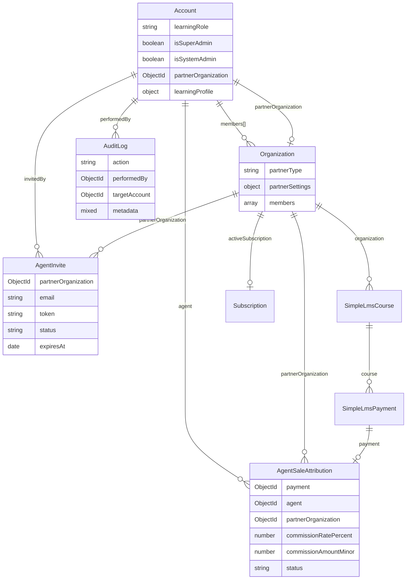

# Solution Architecture
# AI in Nigeria Learning Platform — User Roles & Access Control

**Version:** 1.0  
**Date:** March 10, 2026  
**Companion to:** [PRD-user-roles.md](./PRD-user-roles.md)

---

## 1. Architecture Overview

### 1.1 Current System Architecture

The seemplify-learning platform is a **monolithic Node.js/Express application** with server-rendered EJS views and a MongoDB database (via Mongoose ODM).

```
┌─────────────────────────────────────────────────┐
│                    Browser                       │
│          (EJS-rendered HTML + CSS + JS)          │
└──────────────────────┬──────────────────────────┘
                       │ HTTP
┌──────────────────────▼──────────────────────────┐
│              Express.js Server                   │
│                  (index.js)                      │
│                                                  │
│  ┌────────────┐  ┌──────────────┐  ┌─────────┐ │
│  │ Middleware  │  │    Routes     │  │  Views  │ │
│  │ ─ auth.js  │  │ ─ auth.js    │  │ (EJS)   │ │
│  │ ─ session  │  │ ─ simpleLms  │  │ 16 files│ │
│  │ ─ branding │  │ ─ setup.js   │  └─────────┘ │
│  └────────────┘  └──────────────┘               │
│                                                  │
│  ┌────────────┐  ┌──────────────┐               │
│  │  Services   │  │   Utilities   │              │
│  │ ─ email    │  │ ─ appAccess  │               │
│  │ ─ cloudnry │  │ ─ branding   │               │
│  │ ─ flutter  │  │ ─ simpleLms  │               │
│  │ ─ currency │  │ ─ cart       │               │
│  └────────────┘  └──────────────┘               │
└──────────────────────┬──────────────────────────┘
                       │ Mongoose ODM
┌──────────────────────▼──────────────────────────┐
│               MongoDB (aiinaccounts)             │
│                                                  │
│  Collections:                                    │
│  ─ aiinaccounts        ─ aiinsimplelmsrequests  │
│  ─ aiinorganizations   ─ aiinsimplelmswithdrawals│
│  ─ aiinteams           ─ aiinsimplelmscommission │
│  ─ aiinsimplelmscourses ─ aiinsimplelmsplatform  │
│  ─ aiinsimplelmsenrollments  ─ aiin_subscriptions│
│  ─ aiinsimplelmspayments     ─ aiin_plans       │
│  ─ aiinnotifications    ─ aiinsimplelmspermissions│
│  ─ aiinsimplelmscurrencies                       │
└──────────────────────────────────────────────────┘
```

### 1.2 Post-Implementation Architecture

The user roles feature extends the existing architecture **without changing the monolithic pattern**. New components are additive:

```
┌──────────────────────────────────────────────────────────────────┐
│                         Express.js Server                        │
│                                                                  │
│  Middleware Layer (EXTENDED)                                     │
│  ┌──────────┐ ┌──────────┐ ┌───────────────┐ ┌───────────────┐ │
│  │ auth.js  │ │ roles.js │ │ partnerAccess │ │ auditLogger   │ │
│  │(existing)│ │  (NEW)   │ │   .js (NEW)   │ │   .js (NEW)   │ │
│  └──────────┘ └──────────┘ └───────────────┘ └───────────────┘ │
│                                                                  │
│  Routes Layer (EXTENDED)                                        │
│  ┌──────────┐ ┌──────────────┐ ┌────────────┐ ┌──────────────┐│
│  │ auth.js  │ │ simpleLms.js │ │ partner.js │ │ superUser.js ││
│  │(modified)│ │  (existing)  │ │   (NEW)    │ │   (NEW)      ││
│  └──────────┘ └──────────────┘ └────────────┘ └──────────────┘│
│                                                                  │
│  Models Layer (EXTENDED)                                        │
│  ┌──────────┐ ┌──────────────┐ ┌────────────────────┐         │
│  │Account.js│ │Organization  │ │AgentSaleAttribution│         │
│  │(modified)│ │.js (modified)│ │   .js (NEW)        │         │
│  └──────────┘ └──────────────┘ └────────────────────┘         │
│  ┌──────────┐ ┌──────────────┐                                 │
│  │AuditLog  │ │AgentInvite   │                                 │
│  │.js (NEW) │ │.js (NEW)     │                                 │
│  └──────────┘ └──────────────┘                                 │
│                                                                  │
│  Views Layer (EXTENDED)                                         │
│  ┌──────────────────┐ ┌──────────────┐ ┌──────────────┐       │
│  │partner-dashboard │ │agent-dashboard│ │admin-super-  │       │
│  │.ejs (NEW)        │ │.ejs (NEW)    │ │users.ejs(NEW)│       │
│  └──────────────────┘ └──────────────┘ └──────────────┘       │
└──────────────────────────────────────────────────────────────────┘
```

---

## 2. Data Model Architecture

### 2.1 Modified Models

#### Account Model — Modifications

```javascript
// src/models/Account.js — CHANGES ONLY

// 1. Extend learningRole enum
learningRole: {
  type: String,
  enum: ['super_admin', 'admin', 'creator', 'learner',
         'channel_partner_super', 'channel_partner_user',
         'channel_sales_agent', 'partner_super', 'partner_user'],
  default: 'learner'
}

// 2. Add partner organization link
partnerOrganization: {
  type: ObjectId,
  ref: 'AiinOrganization',
  default: null,
  index: true
}

// 3. Extend registrationIntent enum
learningProfile.registrationIntent: {
  enum: ['learn', 'teach', 'partner', 'channel_partner', 'unknown']
}

// 4. Update getLearningRole() to recognize all 9 values
```

#### Organization Model — Modifications

```javascript
// src/models/Organization.js — CHANGES ONLY

// 1. Add partner type
partnerType: {
  type: String,
  enum: ['none', 'channel_partner', 'partner'],
  default: 'none',
  index: true
}

// 2. Extend member roles
members[].role: {
  enum: ['owner', 'admin', 'hr_manager', 'recruiter', 'interviewer', 'staff',
         'partner_admin', 'partner_user', 'sales_agent']
}

// 3. Add partner settings
partnerSettings: {
  maxAgents: { type: Number, default: null },
  defaultAgentCommissionRate: { type: Number, min: 0, max: 100, default: 10 },
  agentInviteApproval: { type: Boolean, default: true },
  partnerStatus: { type: String, enum: ['pending', 'active', 'suspended'], default: 'pending' }
}
```

### 2.2 New Models

#### AuditLog Model

```javascript
// src/models/AuditLog.js — NEW

const AuditLogSchema = new mongoose.Schema({
  action: {
    type: String,
    required: true,
    enum: [
      'super_user.create', 'super_user.promote', 'super_user.demote',
      'partner.create', 'partner.activate', 'partner.suspend',
      'agent.invite', 'agent.add', 'agent.remove',
      'role.change',
      'course.partner_publish', 'course.partner_approve', 'course.partner_reject'
    ],
    index: true
  },
  performedBy: { type: ObjectId, ref: 'AiinAccount', required: true, index: true },
  targetAccount: { type: ObjectId, ref: 'AiinAccount', default: null },
  targetOrganization: { type: ObjectId, ref: 'AiinOrganization', default: null },
  metadata: { type: Mixed, default: {} },
  ipAddress: { type: String, trim: true, maxlength: 45 },
  userAgent: { type: String, trim: true, maxlength: 500 }
}, {
  timestamps: true,
  collection: 'aiin_audit_logs'
})

// Indexes
AuditLogSchema.index({ createdAt: -1 })
AuditLogSchema.index({ action: 1, createdAt: -1 })
AuditLogSchema.index({ performedBy: 1, createdAt: -1 })

// TTL: auto-delete after 2 years
AuditLogSchema.index({ createdAt: 1 }, { expireAfterSeconds: 730 * 24 * 60 * 60 })
```

#### AgentSaleAttribution Model

```javascript
// src/models/AgentSaleAttribution.js — NEW

const AgentSaleAttributionSchema = new mongoose.Schema({
  payment: { type: ObjectId, ref: 'AiinSimpleLmsPayment', required: true, index: true },
  agent: { type: ObjectId, ref: 'AiinAccount', required: true, index: true },
  partnerOrganization: { type: ObjectId, ref: 'AiinOrganization', required: true, index: true },
  course: { type: ObjectId, ref: 'AiinSimpleLmsCourse', required: true },
  commissionRatePercent: { type: Number, min: 0, max: 100, required: true },
  commissionAmountMinor: { type: Number, min: 0, required: true },
  saleAmountMinor: { type: Number, min: 0, required: true },
  currency: { type: String, trim: true, uppercase: true, default: 'NGN' },
  status: {
    type: String,
    enum: ['pending', 'approved', 'paid', 'cancelled'],
    default: 'pending',
    index: true
  },
  attributedAt: { type: Date, default: Date.now },
  approvedAt: Date,
  paidAt: Date,
  paidBy: { type: ObjectId, ref: 'AiinAccount', default: null },
  referralCode: { type: String, trim: true, maxlength: 40 }
}, {
  timestamps: true,
  collection: 'aiin_agent_sale_attributions'
})

// Indexes
AgentSaleAttributionSchema.index({ agent: 1, status: 1, createdAt: -1 })
AgentSaleAttributionSchema.index({ partnerOrganization: 1, status: 1, createdAt: -1 })
AgentSaleAttributionSchema.index({ payment: 1 }, { unique: true })  // One attribution per payment
```

#### AgentInvite Model

```javascript
// src/models/AgentInvite.js — NEW

const AgentInviteSchema = new mongoose.Schema({
  partnerOrganization: { type: ObjectId, ref: 'AiinOrganization', required: true, index: true },
  invitedBy: { type: ObjectId, ref: 'AiinAccount', required: true },
  email: { type: String, required: true, lowercase: true, trim: true, maxlength: 320 },
  token: { type: String, required: true, unique: true, index: true },
  status: {
    type: String,
    enum: ['pending', 'accepted', 'expired', 'revoked'],
    default: 'pending',
    index: true
  },
  expiresAt: { type: Date, required: true },
  acceptedAt: Date,
  acceptedBy: { type: ObjectId, ref: 'AiinAccount', default: null }
}, {
  timestamps: true,
  collection: 'aiin_agent_invites'
})

// TTL: auto-cleanup expired invites after 7 days past expiry
AgentInviteSchema.index({ expiresAt: 1 }, { expireAfterSeconds: 7 * 24 * 60 * 60 })
```

### 2.3 Entity Relationship Diagram



---

## 3. Middleware Architecture

### 3.1 Request Pipeline

```
HTTP Request
    │
    ▼
┌──────────────┐
│ express.json │  Body parsing
│ cookieParser │
│ session      │
└──────┬───────┘
       │
       ▼
┌──────────────┐
│ optionalAuth │  Attaches user to req if session exists
│  (existing)  │  Sets req.user and res.locals.user
└──────┬───────┘
       │
       ▼
┌──────────────┐
│  branding    │  Resolves AIIN vs Seemplify branding
│  (existing)  │  Sets res.locals.branding
└──────┬───────┘
       │
       ▼
┌──────────────┐
│ requireAuth  │  Redirects to /login if not authenticated
│  (existing)  │  (Used on protected routes only)
└──────┬───────┘
       │
       ▼
┌──────────────┐
│ requireRole  │  Checks learningRole against allowed list
│   (NEW)      │  Returns 403 if unauthorized
└──────┬───────┘
       │
       ▼
┌──────────────┐
│  requirePart │  Validates user is member of partner org
│  nerAccess   │  in route params with correct role
│   (NEW)      │  Returns 403 if unauthorized
└──────┬───────┘
       │
       ▼
┌──────────────┐
│ auditLogger  │  Logs sensitive actions to AuditLog
│   (NEW)      │  (Attached to specific routes only)
└──────┬───────┘
       │
       ▼
  Route Handler
```

### 3.2 New Middleware Specifications

#### `requireRole(allowedRoles)`
```javascript
// src/middleware/roles.js

export function requireRole(allowedRoles) {
  return (req, res, next) => {
    const role = resolveLearningRole(req.user)
    req.learningRole = role

    if (!allowedRoles.includes(role)) {
      return res.status(403).render('error', {
        title: 'Access Denied',
        message: 'You do not have permission to access this page.'
      })
    }
    next()
  }
}
```

#### `requirePartnerAccess(allowedOrgRoles)`
```javascript
export function requirePartnerAccess(allowedOrgRoles) {
  return async (req, res, next) => {
    const orgId = req.params.orgId || req.user?.partnerOrganization
    if (!orgId) return res.status(403).send('No partner organization')

    const org = await Organization.findById(orgId)
    if (!org || org.partnerType === 'none') {
      return res.status(404).send('Partner organization not found')
    }

    const memberRole = org.getMemberRole(req.user._id)
    if (!memberRole || !allowedOrgRoles.includes(memberRole)) {
      return res.status(403).send('Access denied')
    }

    req.partnerOrg = org
    req.partnerMemberRole = memberRole
    next()
  }
}
```

---

## 4. Route Architecture

### 4.1 New Route Files

| File | Mount Point | Purpose |
|------|-------------|---------|
| `src/routes/partner.js` (NEW) | `/partner-dashboard` | Partner dashboard, agents, courses, reports, settings |
| `src/routes/agent.js` (NEW) | `/agent-dashboard` | Agent dashboard, catalog, sales, commissions |
| `src/routes/superUser.js` (NEW) | `/api/super-users` | Super user CRUD API |
| `src/routes/partnerApi.js` (NEW) | `/api/partners` | Partner management API |

### 4.2 Route Registration in index.js

```javascript
// src/index.js — ADDITIONS

import partnerRouter from './routes/partner.js'
import agentRouter from './routes/agent.js'
import superUserApiRouter from './routes/superUser.js'
import partnerApiRouter from './routes/partnerApi.js'

// ... after existing route mounts:
app.use('/partner-dashboard', requireAuth, partnerRouter)
app.use('/agent-dashboard', requireAuth, agentRouter)
app.use('/api/super-users', requireAuth, superUserApiRouter)
app.use('/api/partners', requireAuth, partnerApiRouter)
```

### 4.3 Key Route Definitions

#### Partner Routes (`/partner-dashboard`)

| Method | Path | Middleware | Handler |
|--------|------|-----------|---------|
| GET | `/` | `requireRole([partner roles])`, `requirePartnerAccess` | Render partner dashboard |
| GET | `/agents` | `requireRole([channel partner roles])`, `requirePartnerAccess` | Render agent list |
| POST | `/agents/invite` | `requireRole([cp_super, cp_user])`, `requirePartnerAccess` | Send agent invite |
| DELETE | `/agents/:agentId` | `requireRole([cp_super])`, `requirePartnerAccess` | Remove agent |
| GET | `/courses` | `requireRole([partner roles])`, `requirePartnerAccess` | Render course list |
| POST | `/courses` | `requireRole([partner roles - not agent])`, `requirePartnerAccess` | Create course |
| PUT | `/courses/:id/approve` | `requireRole([cp_super, p_super])`, `requirePartnerAccess` | Approve draft |
| GET | `/reports` | `requireRole([partner roles])`, `requirePartnerAccess` | Render reports |
| GET | `/commissions` | `requireRole([partner roles])`, `requirePartnerAccess` | Render commissions |
| GET | `/settings` | `requireRole([cp_super, p_super])`, `requirePartnerAccess` | Render settings |
| PUT | `/settings` | `requireRole([cp_super, p_super])`, `requirePartnerAccess` | Update settings |

#### Agent Routes (`/agent-dashboard`)

| Method | Path | Middleware | Handler |
|--------|------|-----------|---------|
| GET | `/` | `requireRole(['channel_sales_agent'])` | Render agent dashboard |
| GET | `/courses` | `requireRole(['channel_sales_agent'])` | Render org course catalog |
| GET | `/courses/:id/referral` | `requireRole(['channel_sales_agent'])` | Generate referral link |
| GET | `/sales` | `requireRole(['channel_sales_agent'])` | Render own sales |
| GET | `/commissions` | `requireRole(['channel_sales_agent'])` | Render own commissions |

#### Super User API (`/api/super-users`)

| Method | Path | Middleware | Handler |
|--------|------|-----------|---------|
| GET | `/` | `requireRole(['super_admin'])` | List all super users |
| POST | `/` | `requireRole(['super_admin'])` | Create super user from existing account |
| PUT | `/:id/promote` | `requireRole(['super_admin'])` | Promote to super user |
| PUT | `/:id/demote` | `requireRole(['super_admin'])` | Demote super user |

---

## 5. Payment, Withdrawal & Commission Architecture

### 5.1 Payment Collection Flow (Flutterwave — Existing)

> This flow is **already implemented** and continues unchanged. It is documented here for completeness as it underpins the commission and withdrawal systems.

```
Learner clicks "Buy Course" on course page
    │
    ▼
Server creates SimpleLmsPayment record:
  { account: learnerId, course: courseId, creatorAccount: creatorId,
    provider: 'flutterwave', txRef: 'unique-tx-ref',
    amountMinor: priceInKobo, status: 'initiated' }
    │
    ▼
Server calls flutterwaveService.createFlutterwavePaymentLink({
    txRef, amountMinor, currency: 'NGN',
    redirectUrl: '/simple-lms/payment/verify',
    customerEmail, customerName, title, description
})
    │
    ▼
Flutterwave returns checkout URL (result.data.link)
    │
    ▼
Learner redirected to Flutterwave checkout page
  (Options: card, bank transfer, USSD)
    │
    ▼
Learner completes payment on Flutterwave
    │
    ▼
Flutterwave redirects to /simple-lms/payment/verify?tx_ref=...&transaction_id=...
    │
    ▼
Server calls flutterwaveService.verifyFlutterwaveTransaction(transactionId)
  (GET /transactions/{id}/verify via Flutterwave API)
    │
    ▼
Verification result checked:
  └─ If status !== 'successful' → payment marked as failed
  └─ If status === 'successful' → continue:
    │
    ▼
Commission calculated (from SimpleLmsCommissionSetting):
  commissionRate = resolve(perCourse || perCreator || global default 70%)
  creatorCommissionMinor = amountMinor × (commissionRate / 100)
  platformShareMinor = amountMinor - creatorCommissionMinor
    │
    ▼
SimpleLmsPayment updated:
  { status: 'successful', flutterwaveTxId, flutterwaveStatus,
    creatorCommissionRate, creatorCommissionMinor, platformShareMinor,
    paidAt, verifiedAt, verificationPayload }
    │
    ▼
SimpleLmsEnrollment created:
  { account: learnerId, course: courseId, status: 'active', assignedBy: 'self' }
    │
    ▼
[If agent referral code in session] (NEW):
  agentRate = partnerSettings.defaultAgentCommissionRate
  agentCommissionMinor = platformShareMinor × (agentRate / 100)
  AgentSaleAttribution created:
    { payment, agent, partnerOrg, commissionRate, commissionAmount, status: 'pending' }
```

**Key models involved:**
- `SimpleLmsPayment` — payment record with status lifecycle: `initiated → pending → successful / failed / cancelled / refunded`
- `SimpleLmsCommissionSetting` — commission rates (global, per-creator, per-course)
- `SimpleLmsEnrollment` — learner access to course
- `AgentSaleAttribution` (NEW) — agent commission tracking

### 5.2 Creator Withdrawal Flow (Existing Model, Enhanced UI)

> The `SimpleLmsWithdrawal` model already exists with proper lifecycle fields. The admin UI for reviewing and processing withdrawals needs to be built.

```
Creator views Earnings Dashboard
  Shows: total earned, total withdrawn, pending withdrawals, available balance
    │
    ▼
Creator clicks "Request Withdrawal"
  Form: amount (≤ available balance), optional notes
  Validation: payout profile must be complete (bank name, account, etc.)
    │
    ▼
SimpleLmsWithdrawal created:
  { creatorAccount: creatorId,
    amountMinor: requestedAmount,
    currency: 'NGN',
    status: 'pending',
    requestedAt: now,
    notes: creatorNotes,
    payoutProfileSnapshot: {
      accountName, accountNumber, bankName, bankCode,
      swiftCode, paymentEmail, country, notes
    }  // ← FROZEN at request time from Account.payoutProfile
  }
    │
    ▼
Creator sees withdrawal in history with status: 🟡 Pending
Creator can cancel while pending (status → 'cancelled')
    │
    ▼
System Admin views Withdrawal Queue (admin dashboard)
  Shows: creator name, email, amount, requested date, payout profile snapshot
    │
    ├─── APPROVE:
    │   status: 'approved'
    │   reviewedBy: adminId
    │   reviewedAt: now
    │   Creator notified: "Your withdrawal of ₦X has been approved"
    │       │
    │       ▼
    │   Withdrawal appears in "Approved — Awaiting Payout" queue
    │       │
    │       ▼
    │   Admin manually transfers ₦X to creator's bank account
    │   (via bank portal, Flutterwave dashboard, or direct transfer)
    │   └─ THIS HAPPENS OUTSIDE THE SYSTEM
    │       │
    │       ▼
    │   Admin clicks "Mark as Paid"
    │   Enters: transactionRef (optional), adminNotes (optional)
    │       │
    │       ▼
    │   status: 'paid'
    │   paidBy: adminId
    │   paidAt: now
    │   transactionRef: 'BANK-REF-123'
    │   Creator notified: "Your withdrawal of ₦X has been paid"
    │   └─ FINAL STATE — no more transitions
    │
    └─── REJECT:
        status: 'rejected'
        reviewedBy: adminId
        reviewedAt: now
        adminNotes: 'Reason for rejection'
        Creator notified: "Your withdrawal was rejected: [reason]"
        Creator's available balance restored
```

**Withdrawal status lifecycle:**
```
                 ┌───────── cancelled (by creator)
                 │
pending ────────┼───────── rejected (by admin) + adminNotes
                 │
                 └───────── approved (by admin) ───────→ paid (by admin) + transactionRef
                                                        │
                                                   FINAL STATE
```

**Existing model schema (unchanged — `SimpleLmsWithdrawal.js`):**

| Field | Type | Purpose |
|-------|------|---------|
| `creatorAccount` | ObjectId (ref Account) | Who requested the withdrawal |
| `amountMinor` | Number | Amount in minor units (kobo) |
| `currency` | String | Default: NGN |
| `status` | Enum | `pending`, `approved`, `paid`, `rejected`, `cancelled` |
| `requestedAt` | Date | When the request was made |
| `notes` | String | Creator's notes (1200 char max) |
| `adminNotes` | String | Admin's notes/rejection reason (3000 char max) |
| `payoutProfileSnapshot` | Object | Frozen bank details from time of request |
| `reviewedBy` | ObjectId (ref Account) | Admin who approved/rejected |
| `reviewedAt` | Date | When the review happened |
| `paidBy` | ObjectId (ref Account) | Admin who marked as paid |
| `paidAt` | Date | When marked as paid |
| `transactionRef` | String | Bank transfer reference number |
| `metadata` | Map | Extensible metadata |

### 5.3 Agent Commission Payout Flow (Centralized Through System Admin)

> [!IMPORTANT]
> **Design decision:** All payouts are centralized through the System Admin. Partner Super Users can view and **recommend** agent payouts, but cannot approve or process them. This ensures trust, auditability, and a single point of financial control.

```
Agent sale attributed (from Section 5.1)
  AgentSaleAttribution created with status: 'pending'
    │
    ▼
Agent sees commission in Agent Dashboard
  Shows: total earned, pending payout, paid out
  (sale-by-sale trace with amounts and percentages)
    │
    ▼
Partner Super User views Agent Commissions
  List: agent name, total pending, # of sales, date range
  Can view agent's payout profile (bank details) for reference
    │
    ▼
Partner Super User clicks "Recommend for Payout" (batch or individual)
  AgentSaleAttribution.status: 'recommended'
  recommendedBy: partnerSuperUserId
  recommendedAt: now
    │
    ▼
System Admin sees recommended agent payouts in unified payout queue
  (alongside creator withdrawals and partner org withdrawals)
  Reviews: agent name, partner org, attributed sales, payout profile
    │
    ├─── APPROVE:
    │   AgentSaleAttribution.status: 'approved'
    │   approvedBy: adminId, approvedAt: now
    │       │
    │       ▼
    │   System Admin manually transfers money to agent
    │   (via bank portal — outside the system)
    │       │
    │       ▼
    │   System Admin clicks "Mark as Paid"
    │   paidBy: adminId, paidAt: now, transactionRef: 'BANK-REF'
    │   Status: 'paid' (FINAL)
    │
    └─── REJECT:
        AgentSaleAttribution.status reverts to 'pending'
        Admin notes added; partner super user notified
```

**Agent commission status lifecycle:**
```
pending ───→ recommended (by partner) ───→ approved (by admin) ───→ paid (by admin)
                  │                             │
                  └── rejected back to pending   └── rejected back to pending
```

**Key design decisions:**
- Agent commission is carved from the **platform share**, not the total sale. Creator earnings are never impacted by agent sales.
- Partner Super Users **recommend** but cannot approve or pay — all money flows through System Admin.
- System Admin's unified queue shows all three payout types: creator withdrawals, partner org withdrawals, agent commissions.

### 5.4 Payout Profiles for All Earning Roles

> All earning roles (Creator, Agent, Partner Org) use the same payout profile structure. This is already implemented in `Account.payoutProfile` for creators; agents and partners reuse it.

**Who configures payout profiles and where:**

| Earning Role | Payout Profile Location | Configured By | Used When |
|-------------|------------------------|---------------|-----------|
| Creator | `Account.payoutProfile` (existing) | Creator in Settings | Creator withdrawal request |
| Channel Sales Agent | `Account.payoutProfile` (reuse same structure) | Agent in Agent Dashboard → Settings | Partner Super User processes agent payout |
| Partner Organization | `Organization.partnerSettings.payoutProfile` (new) | Partner Super User in Org Settings | Partner org withdrawal request |

**Payout profile fields (all use same structure):**
```
{
  accountName: String,     // "Ada Obi"
  accountNumber: String,   // "0123456789"
  bankName: String,        // "GTBank"
  bankCode: String,        // "058"
  swiftCode: String,       // (optional, for international)
  currency: String,        // "NGN" (default)
  paymentEmail: String,    // (optional, for digital payments)
  country: String,         // "Nigeria"
  notes: String,           // (optional)
  updatedAt: Date
}
```

**Partner org withdrawal flow (extends creator withdrawal):**
```
Partner Super User views Org Earnings Dashboard
  Shows: total org course sales, org commission earned, withdrawn, available balance
    │
    ▼
Partner Super User clicks "Request Org Withdrawal"
  SimpleLmsWithdrawal created:
    { organization: partnerOrgId, amountMinor, status: 'pending',
      payoutProfileSnapshot: frozen from Organization.partnerSettings.payoutProfile }
    │
    ▼
System Admin reviews and approves/rejects (same as creator withdrawal)
    │
    ▼
System Admin manually transfers to org bank account → marks as paid
```

### 5.5 Earnings Trace — Data Model & Queries

> Every payout/withdrawal must be traceable back to individual course sales with full percentage breakdowns.

**Per-sale money flow record:**
```
For each successful SimpleLmsPayment:

Sale Amount: amountMinor  (e.g., ₦10,000)
  ├── Creator Commission: creatorCommissionMinor (e.g., ₦7,000 at 70%)
  ├── Platform Share:     platformShareMinor    (e.g., ₦3,000 at 30%)
  │   ├── Agent Commission: AgentSaleAttribution.commissionAmountMinor (e.g., ₦300 at 10%)
  │   └── Net Platform:    platformShareMinor - agentCommission (e.g., ₦2,700)
  └── Total:             amountMinor ✓ (everything accounted for)
```

**Query patterns for each viewer:**

| Viewer | Query | What They See |
|--------|-------|--------------|
| **Creator** | `SimpleLmsPayment.find({ creatorAccount: self, status: 'successful' })` | Own sales: course, buyer, amount, commission rate, commission earned |
| **Agent** | `AgentSaleAttribution.find({ agent: self }).populate('payment course')` | Attributed sales: course, buyer, sale amount, platform share, agent rate, agent commission |
| **Partner Super User** | `AgentSaleAttribution.find({ partnerOrganization: orgId }).populate('agent payment course')` | All agents' sales: per-agent breakdown, commission amounts, payout profiles |
| **Admin (withdrawal review)** | `SimpleLmsPayment.find({ creatorAccount: withdrawalCreator, status: 'successful' })` joined with `AgentSaleAttribution` | Full money flow per sale: total → creator share → platform share → agent share (if any) → net platform |
| **Admin (financial dashboard)** | All `SimpleLmsPayment` + all `AgentSaleAttribution` | Platform-wide money flow with payout status tracking |

---

## 6. Security Architecture

### 6.1 Access Control Matrix (Technical)

```
Route Access = requireAuth + requireRole + requirePartnerAccess

Level 1: Authentication (existing requireAuth)
  → Is user logged in? → Redirect to /login if not

Level 2: Role Check (new requireRole)
  → Does user's learningRole match allowed list? → 403 if not

Level 3: Organization Check (new requirePartnerAccess)
  → Is user a member of the target partner org? → 403 if not
  → Does their org member role match? → 403 if not

Level 4: Resource Check (in-handler)
  → Does the specific resource belong to the user's org/scope?
  → e.g., agent can only view own commissions, partner user can only edit own drafts
```

### 6.2 Data Isolation

| Data Type | Super Admin | Admin | Partner Super | Partner User | Agent | Creator | Learner |
|-----------|-------------|-------|--------------|-------------|-------|---------|---------|
| All accounts | ✅ | ✅ (read) | Own org only | Own org only | Own only | Own only | Own only |
| All organizations | ✅ | ✅ (read) | Own org only | Own org only | Own org (read) | — | — |
| All payments | ✅ | ✅ (read) | Own org agents' sales | Own org agents' sales | Own sales | Own sales | Own purchases |
| All withdrawals | ✅ (review + payout) | — | Request org withdrawal | — | — | Own requests | — |
| Agent payouts | ✅ (approve + payout) | — | Own org agents (recommend only) | — | Own payouts (read) | — | — |
| All courses | ✅ | ✅ | Own org courses | Own org courses (draft own) | Own org (read) | Own courses | Public courses |
| Commission settings | ✅ | — | Own org agent rates | — | — | — | — |
| Audit log | ✅ | — | — | — | — | — | — |

---

## 7. File Inventory

### 7.1 New Files (13 files)

| File | Type | Est. Lines | Purpose |
|------|------|-----------|---------|
| `src/middleware/roles.js` | Middleware | ~60 | `requireRole()`, `requirePartnerAccess()` |
| `src/middleware/auditLogger.js` | Middleware | ~30 | Audit log helper |
| `src/models/AuditLog.js` | Model | ~50 | Audit log schema |
| `src/models/AgentSaleAttribution.js` | Model | ~70 | Agent commission tracking |
| `src/models/AgentInvite.js` | Model | ~50 | Agent invite tokens |
| `src/routes/partner.js` | Route | ~400 | Partner dashboard routes |
| `src/routes/agent.js` | Route | ~200 | Agent dashboard routes |
| `src/routes/superUser.js` | Route | ~150 | Super user API |
| `src/routes/partnerApi.js` | Route | ~300 | Partner management API |
| `src/views/partner-dashboard.ejs` | View | ~600 | Partner dashboard |
| `src/views/agent-dashboard.ejs` | View | ~400 | Agent dashboard |
| `src/views/admin-super-users.ejs` | View | ~200 | Super user management |
| `src/views/admin-partners.ejs` | View | ~300 | Partner organization list |

### 7.2 Modified Files (5 files)

| File | Change Description |
|------|-------------------|
| `src/models/Account.js` | Extend `learningRole` enum, add `partnerOrganization` field, extend `registrationIntent`, update `getLearningRole()` |
| `src/models/Organization.js` | Add `partnerType`, extend member `role` enum, add `partnerSettings` |
| `src/routes/auth.js` | Extend `LEARNING_INTENTS`, update `sanitizeIntent()`, add role-based registration logic |
| `src/index.js` | Update `resolveLearningRole()`, mount new routers, add role constants |
| `src/views/register.ejs` | Add partner/channel partner intent options |

### 7.3 Unchanged Files (All Others)

All existing models, services, utilities, and views remain unchanged. The architecture is fully additive — no breaking changes to existing functionality.

### 7.4 Existing Files — Payment & Withdrawal (Unchanged)

These files already exist and require **no modifications** for the user roles feature. Documented here for reference as they underpin the payment and withdrawal systems:

| File | Type | Lines | Purpose |
|------|------|-------|---------|
| `src/models/SimpleLmsPayment.js` | Model | 118 | Flutterwave payment records with commission split fields |
| `src/models/SimpleLmsWithdrawal.js` | Model | 135 | Creator payout request lifecycle (pending/approved/paid/rejected/cancelled) |
| `src/models/SimpleLmsCommissionSetting.js` | Model | ~80 | Global, per-creator, and per-course commission rates |
| `src/services/flutterwaveService.js` | Service | 97 | Flutterwave API integration (create payment link, verify transaction) |
| `src/models/SimpleLmsEnrollment.js` | Model | ~60 | Learner enrollment records created on successful payment |

---

## 8. Deployment Considerations

### 8.1 Database Migration

- **No breaking schema changes:** New fields use `default` values; existing documents continue to work
- `learningRole` enum extension: Existing values remain valid; new values only assigned to new accounts
- `Organization.partnerType`: Defaults to `'none'` for all existing organizations
- `Account.partnerOrganization`: Defaults to `null` for all existing accounts
- **No migration script required** — Mongoose handles defaults transparently

### 8.2 Feature Flags (Optional)

Consider wrapping new routes behind a feature flag during phased rollout:

```javascript
const FEATURE_PARTNER_SYSTEM = process.env.ENABLE_PARTNER_SYSTEM === 'true'

if (FEATURE_PARTNER_SYSTEM) {
  app.use('/partner-dashboard', requireAuth, partnerRouter)
  app.use('/agent-dashboard', requireAuth, agentRouter)
  app.use('/api/partners', requireAuth, partnerApiRouter)
}
```

### 8.3 Rollback Strategy

Since all changes are additive:
1. Remove new route mounts from `index.js`
2. New collections can remain (orphaned but harmless)
3. New fields on existing models are ignored by old code
4. No data loss on rollback
